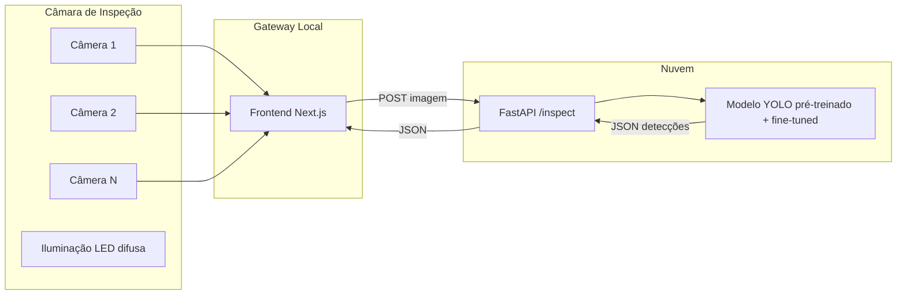
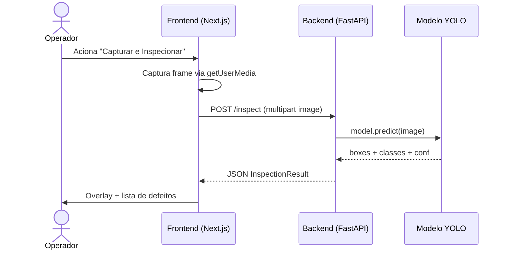

# 02 — Arquitetura

## Diagrama de blocos

## Fluxo de inspeção (sequence)

## Decisões arquiteturais

### Nuvem vs. Edge

Optamos por **inferência na nuvem via API REST** por três razões:

1. **Custo inicial zero** — serviços como Hugging Face Spaces e Render
   oferecem tier gratuito suficiente para protótipo e demonstração.
2. **Escalabilidade do modelo** — atualizar o modelo significa apenas
   re-deployar a API; não exige atualizar hardware dentro da câmara.
3. **Flexibilidade didática** — o projeto pode comparar provedores
   (Roboflow, AWS Rekognition Custom Labels, Azure Custom Vision) sem
   reescrever o cliente.

Trade-off: dependência de rede. Mitigação prevista em fases futuras:
buffer local de imagens e retry exponencial.

### Protocolo

`HTTP/REST` com `multipart/form-data` é suficiente para o regime alvo
(<2 s por inspeção). WebSocket/RTSP ficam como evolução para streaming
contínuo.

### Contratos

Ver [`04-modelo-ia.md`](./04-modelo-ia.md) para o schema de resposta
(`InspectionResult`) e [`05-deploy-nuvem.md`](./05-deploy-nuvem.md) para
a topologia de deploy.
